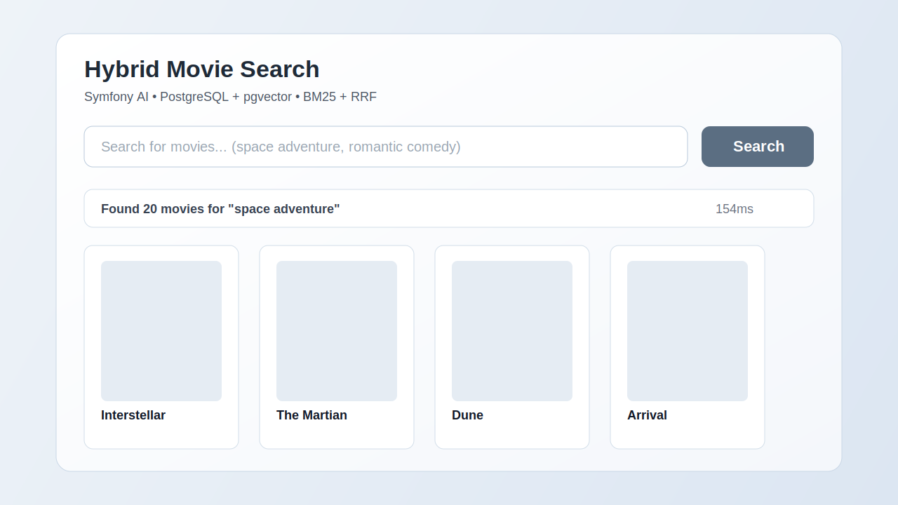

# Symfony AI Hybrid Search Demo (PostgreSQL)

Démo d’un moteur de recherche hybride de films avec **Symfony AI Store** et PostgreSQL:
- recherche sémantique (`pgvector`)
- recherche textuelle (`BM25` / FTS)
- fusion des résultats via RRF

## Prérequis

- PHP `>= 8.2`
- Composer
- Docker + Docker Compose
- Symfony CLI (optionnel, mais recommandé)
- Au moins 8 Go de RAM disponibles (Ollama + PostgreSQL)

## Installation

1. Cloner le projet puis entrer dans le dossier.
2. Lancer les services Docker:

```bash
docker compose up -d
```

3. Installer les dépendances PHP:

```bash
composer install
```

4. Télécharger le modèle d'embedding Ollama:

```bash
docker exec -it ollama_embeddings ollama pull nomic-embed-text
```

5. Initialiser le store PostgreSQL:

```bash
php bin/console ai:store:setup ai.store.postgres.movies
```

6. Importer les films:

```bash
php bin/console app:import-movies --limit=1000 --batch-size=50
```

7. Lancer l'application:

```bash
symfony server:start
```

L’interface est ensuite disponible sur `http://127.0.0.1:8000`.

## Capture de l'application



## Endpoints API

- `GET /api/search?q=...&ratio=0.30`
- `GET /api/search/bm25?q=...&limit=5`
- `GET /api/search/native?q=...&limit=5`
- `GET /api/compare?q=...`

## Test rapide

```bash
curl "http://127.0.0.1:8000/api/search/bm25?q=green+ogre&limit=5"
curl "http://127.0.0.1:8000/api/search/native?q=green+ogre&limit=5"
```

## Notes

- Le projet est configuré avec des dépendances locales Symfony AI (repositories `type: path` dans `composer.json`).
- Si vous n'avez pas ces sources locales, adaptez `composer.json` avant `composer install`.
